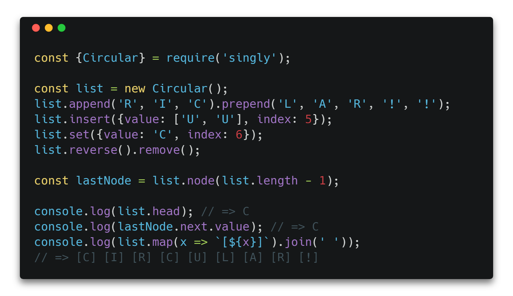

<h1 align="center">
  Singly
</h1>

<h4 align="center">
  ⚡ Singly circular & linear linked lists for ES6
</h4>

<div align="center">
  
</div>

<p align="center">
  <a href="https://travis-ci.org/klauscfhq/singly">
    
  </a>
  <a href='https://coveralls.io/github/klauscfhq/singly?branch=master'>
    
  </a>
</p>

## Description

Progressive and minimal implementation of the circular and linear singly linked list data structures for modern ES6.

Come over to [Gitter](https://gitter.im/klauscfhq/singly) or [Twitter](https://twitter.com/klauscfhq) to share your thoughts on the project.

## Contents

- [Description](#description)
- [Install](#install)
- [Usage](#usage)
- [API](#api)
- [Development](#development)
- [Team](#team)
- [License](#license)

## Install

```bash
npm install singly
```

## Usage

Singly exposes a progressive and serializable API, that can be utilized through a simple and minimal syntax, allowing you to combine and chain methods effectively.

### Linear

```js
const {Linear} = require('.');

const linear = new Linear();
const {log} = console;

// Append a node holding a value of `E`
linear.append('E');
log(linear.head); // => E
log(linear.last); // => E
log(linear.get(0)); // => E

// Return the node corresponding to the index
log(linear.node(0)); // => Node {_value: 'E', _next: null}
log(linear.node(0).value); // => E
log(linear.node(0).next); // => null

// Append multiple nodes at once
linear.append('F', 'G');
log(linear.length); // => 3
log(linear.node(0).next.value); // => F
log(linear.node(0).next.next.value); // => G
log(linear.toArray()); // => [ 'E', 'F', 'G' ]

// Prepend multiple nodes at once
linear.prepend('B', 'A');
log(linear.join(' ')); // => A B E F G

// Insert multiple nodes to the given index
linear.insert({value: ['D', 'C', 'X'], index: 2});
log(linear.join(' ')); // => A B X C D E F G

// Remove the node corresponding to the index
linear.remove(2);
log(linear.join(' ')); // => A B C D E F G

// Set the value of a node corresponding to the index
linear.node(linear.length - 1).value = '!';
log(linear.join(' ')); // => A B C D E F !
linear.set({value: 'G', index: linear.length - 1});
log(linear.join(' ')); // => A B C D E F G

// Iterate over the list
const array = [];
linear.forEach(x => array.push(x));
log(array);
// => [ 'A', 'B', 'C', 'D', 'E', 'F', 'G' ]

// Chain multiple methods
log(linear.reverse().map(x => `[${x}]`).join('->'));
// => [G]->[F]->[E]->[D]->[C]->[B]->[A]

// Clear a list
log(linear.clear());
// => Linear {_head: null, _length: 0}
```

### Circular

```js
const {Circular} = require('.');

const circular = new Circular();
const {log} = console;

// Append a node holding a value of `E`
circular.append('E');
log(circular.head); // => E
log(circular.last); // => E
log(circular.get(0)); // => E

// Return the node corresponding to the index
log(circular.node(0)); // => Node {_value: 'E', _next: [Circular]}
log(circular.node(0).value); // => E
log(circular.node(0).next.value); // => E
log(circular.node(0).next.next.value); // => E

// Append multiple nodes at once
circular.append('F', 'G');
log(circular.length); // => 3
log(circular.node(0).next.value); // => F
log(circular.node(0).next.next.value); // => G
log(circular.node(0).next.next.next.value); // => E
log(circular.toArray()); // => [ 'E', 'F', 'G' ]

// Prepend multiple nodes at once
circular.prepend('B', 'A');
log(circular.join(' ')); // => A B E F G

// Insert multiple nodes to the given index
circular.insert({value: ['D', 'C', 'X'], index: 2});
log(circular.join(' ')); // => A B X C D E F G

// Remove the node corresponding to the index
circular.remove(2);
log(circular.join(' ')); // => A B C D E F G

// Set the value of a node corresponding to the index
circular.node(circular.length - 1).value = '!';
log(circular.join(' ')); // => A B C D E F !
circular.set({value: 'G', index: circular.length - 1});
log(circular.join(' ')); // => A B C D E F G

// Iterate over the list
const array = [];
circular.forEach(x => array.push(x));
log(array);
// => [ 'A', 'B', 'C', 'D', 'E', 'F', 'G' ]

// Chain multiple methods
log(circular.reverse().map(x => `[${x}]`).join('->'));
// => [G]->[F]->[E]->[D]->[C]->[B]->[A]

// Clear a list
log(circular.clear());
// => Circular {_head: null, _length: 0}
```

## API

## Development

For more info on how to contribute to the project, please read the [contributing guidelines](https://github.com/klauscfhq/singly/blob/master/contributing.md).

- Fork the repository and clone it to your machine
- Navigate to your local fork: `cd singly`
- Install the project dependencies: `npm install` or `yarn install`
- Lint code and run the tests: `npm test` or `yarn test`

## Team

- Klaus Sinani [(@klauscfhq)](https://github.com/klauscfhq)

## License

[MIT](https://github.com/klauscfhq/singly/blob/master/license.md)
